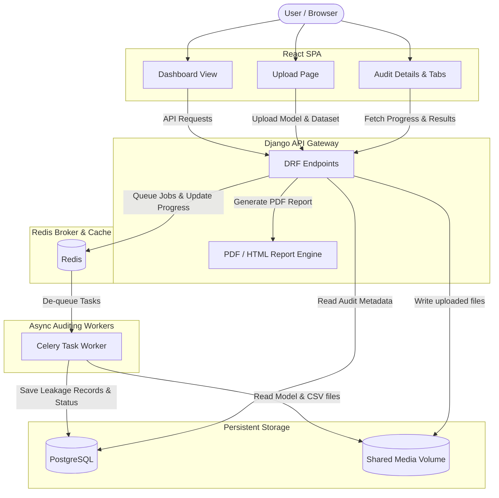

# ModelDoctor: ML Model Auditing and Certification Platform

ModelDoctor is an auditing platform designed for evaluating, diagnosing, and certifying Machine Learning models. It checks models for target leakage, miscalibration, overfitting, algorithmic bias, and data drift, outputting a composite Health Score (Grade A–F) and a downloadable PDF report.

---

## 1. Problem Framing

Deploying ML models in production is risky due to silent failure modes. Standard metrics (e.g. test set accuracy) fail to detect structural issues:
- **Target Leakage**: Future information or target-derived columns leak into training, artificially inflating accuracy. Once deployed, performance collapses because the leaky feature is unavailable.
- **Miscalibration**: Models output confidence scores that don't match empirical frequencies (e.g., a "90% confident" model is only correct 60% of the time), leading to risky decision-making.
- **Overfitting**: Complex estimators memorize train data without generalizing, leading to validation drops.
- **Algorithmic Fairness Violations**: Models propagate historical human bias, leading to discriminatory outcomes against protected groups.
- **Data Drift**: Distribution shifts between training data and production data invalidate model assumptions over time.

ModelDoctor audits these factors, giving engineers clear diagnostic reports before shipping models.

---

## 2. Architecture Overview

ModelDoctor is built as a modular, decoupled full-stack application using a containerized microservices architecture.



---

## 3. Key Algorithmic Decisions & Formulations

### A. Target Leakage Detection
ModelDoctor evaluates feature leakage using a **3-Signal System**:
1. **Known Feature Metadata**: Users toggle which features are explicitly known at prediction time. Any feature not known but having high predictive weight is flagged.
2. **Global Feature Importance (SHAP)**: We run a game-theoretic SHAP tree/linear explainer on a subset of the data. Features carrying a dominant share ($> 50\%$) of predictive importance are flagged.
3. **Retrain Performance Drop %**: We temporarily drop the feature and retrain the model. If dropping a single feature causes a performance collapse ($> 10\%$ drop), it is highly likely to be a leaky target proxy.

### B. Composite Health Score Formulation
The Health Score is computed as a weighted deduction from $100$:

$$\text{Health Score} = 100 - \sum (w_i \times P_i)$$

Where $P_i \in [0, 100]$ is the normalized penalty of each module and $w_i$ is its weight:

| Audited Dimension | Weight ($w_i$) | Normalization & Rationale |
|---|---|---|
| **Target Leakage** | `0.30` | **Highest Weight**: Target leakage invalidates the model's design; no post-hoc fix is possible without full retraining. Normalized by the maximum risk score of any feature. |
| **Overfitting Gap** | `0.20` | Measures train-val gap across cross-validation folds. High gap indicates poor generalizability. Normalized linearly up to a $50\%$ gap. |
| **Fairness Violation** | `0.20` | Demographic Parity and Equalized Odds differences. Prevents deployment of discriminatory models. Penalty = $\max(\text{DP Diff}, \text{EO Diff}) \times 100$. |
| **Data Quality** | `0.15` | Average of missing value %, duplicate row %, and outlier rates. These degrade model training signal. |
| **Calibration Error** | `0.15` | **Lowest Weight**: Brier score (scaled $0 \rightarrow 0.25$). Miscalibration is often corrigible post-hoc (e.g. Platt Scaling) without retraining, making it the least critical structural failure mode. |

*The final score is strictly clamped to $[0.0, 100.0]$. Letter grades are mapped as: **A** (85-100), **B** (70-84), **C** (55-69), **D** (40-54), and **F** (0-39).*

### C. Algorithmic Fairness Metrics (Fairlearn)
We compute two demographic disparities across groups of the `protected_attribute`:
- **Demographic Parity Difference**: The gap between the highest and lowest group selection rates (probability of positive predictions).
- **Equalized Odds Difference**: The maximum gap in True Positive Rate (TPR) or False Positive Rate (FPR) across groups.

> [!NOTE]
> **Normative Trade-offs:** The Fairness tab includes a caveat explaining that mathematical definitions of fairness often conflict (e.g. enforcing demographic parity can degrade calibration or utility). Results are guidelines for audit reviews rather than simple pass/fail flags.

### D. Data Drift Monitoring (Population Stability Index & KS-test)
If a user uploads a secondary production dataset, we measure:
- **Population Stability Index (PSI)**: Quantifies how much the distribution of a feature has shifted:
  $$PSI = \sum \left( (Actual\% - Expected\%) \times \ln\left(\frac{Actual\%}{Expected\%}\right) \right)$$
  Features with $PSI > 0.2$ are flagged for significant distribution drift.
- **Kolmogorov-Smirnov (KS) test**: Compares the continuous distributions of numerical features; p-values $< 0.05$ indicate statistically significant drift.

---

## 4. Pre-computed Demo Sandbox Models

ModelDoctor includes a **No-Login Demo Sandbox** serving three static pre-computed audits:
1. **Titanic Target Leakage (Grade F, Score: 38.5)**: Simulates a classic leakage error where `Survived` information is leaked into a helper feature `PassengerId_plus_Survived`. SHAP and Retrain Drop quickly isolate the leak.
2. **Well-Calibrated Estimator (Grade A, Score: 97.2)**: A well-fitted classifier showing low overfitting, negligible feature dominance, and ideal reliability calibration curves.
3. **Biased Loan Approver (Grade B, Score: 75.8)**: Evaluates a credit approval classifier with Gender as the protected attribute. It flags a high demographic parity difference ($0.45$), lowering the composite score.

---

## 4.5. Trial Test Datasets & Models for Live Upload

We provide matching datasets and model files under **`backend/sample_datasets/`** to let you test live model auditing on the platform:
- **Titanic Target Leakage Trial**:
  - **Dataset**: `backend/sample_datasets/titanic_leaky.csv`
  - **Model File**: `backend/sample_datasets/titanic_model.pkl` (A DecisionTree pipeline supporting string inputs)
  - **Target Column**: `Survived`
  - **Details**: Tests target leakage. The feature `PassengerId_plus_Survived` acts as a leakage proxy.
- **Credit Approval Bias & Drift Trial**:
  - **Dataset**: `backend/sample_datasets/credit_biased.csv`
  - **Model File**: `backend/sample_datasets/credit_model.pkl` (A DecisionTree pipeline supporting string inputs)
  - **Target Column**: `Approved`
  - **Protected Attribute**: `Gender` (Select this option in the dropdown during upload)
  - **Details**: Tests algorithmic fairness. To test data drift, upload `backend/sample_datasets/credit_production_drifted.csv` as the production dataset on the job details view after the initial run completes.

---

## 5. Local Setup & Quickstart

### Prerequisites
- **Docker Desktop** (with Compose v2+)

### Run Services
1. Duplicate `.env.example` as `.env` and set values if desired.
2. Start all services in the background:
   ```bash
   docker compose up -d
   ```
3. Run Django migrations:
   ```bash
   docker compose exec backend python manage.py migrate
   ```
4. Access:
   - **Frontend App**: [http://localhost:5173](http://localhost:5173) (Click *Explore Demo Sandbox* to enter without credentials)
   - **Backend API**: [http://localhost:8000/api/](http://localhost:8000/api/)
   - **Django Admin Portal**: [http://localhost:8000/admin/](http://localhost:8000/admin/)

### Run Backend Test Suite
Run the 32 pytest diagnostics tests:
```bash
docker compose exec backend pytest tests/ -v
```

---

## 6. Known Limitations & Security Considerations

- **Serialization Vulnerability**: Loading `.pkl` or `.joblib` model files involves executing arbitrary python code via `pickle`. In production, this must be restricted to sandboxed worker environments or replaced with ONNX/PMML format parsers.
- **Tabular Data Focus**: Data quality (missing values, duplicates, IQR outliers) and SHAP tree explainers are currently optimized for tabular inputs (CSVs) and tabular models. Text, image, or graph models require custom pre-processors.
